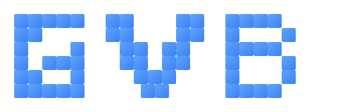
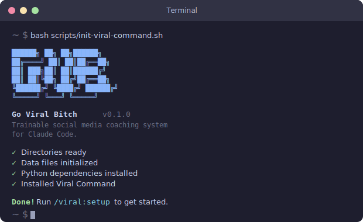

<p align="center">
  
</p>

<h1 align="center">GO VIRAL BITCH</h1>

<p align="center">
  A trainable social media coaching system for Claude Code.<br/>
  Finds winning topics, develops angles, generates hooks, learns from performance.
</p>

<p align="center">
  
  
  
  <a href="https://start.ccstrategic.io/skool"></a>
</p>

<br/>

```bash
git clone https://github.com/charlesdove977/goviralbitch.git && cd goviralbitch && bash scripts/init-viral-command.sh
```

<p align="center">Works on Mac, Windows (WSL), and Linux.</p>

<br/>

<p align="center">
  
</p>

<br/>

---

## The Pipeline

```
 DISCOVER ──> ANGLE ──> SCRIPT ──> PUBLISH ──> ANALYZE
    ^                                             |
    |                                             |
    └─── feedback loop (brain evolves) ───────────┘
```

| Stage | What Happens |
|-------|-------------|
| **Discover** | Scan 9+ platforms for trending topics, score against your ICP, track competitors |
| **Angle** | Apply Contrast Formula to turn raw topics into platform-specific angles with CTA direction |
| **Script** | Generate hooks (6 patterns), full scripts (longform/shortform), filming cards, PDF lead magnets |
| **Publish** | Schedule content via calendar, track ideas through pipeline stages |
| **Analyze** | Pull analytics, extract winners, identify patterns, auto-update brain and hook repository |

---

## Commands

| Command | What It Does |
|---------|-------------|
| `/viral:setup` | Platform connection wizard — dependency check, API config, verification |
| `/viral:onboard` | Interactive agent brain setup — ICP, pillars, platforms, competitors |
| `/viral:discover` | Multi-platform topic discovery scored against your ICP |
| `/viral:angle` | Contrast Formula angle development with platform templates |
| `/viral:script` | HookGenie hooks + script generation (longform/shortform/PDF) |
| `/viral:analyze` | Multi-platform analytics + winner extraction + feedback loop |
| `/viral:ideas` | Idea board CRUD + pipeline funnel + content repurposing |
| `/viral:status` | Pipeline dashboard — funnel, calendar, brain health |
| `/viral:update-brain` | Brain evolution protocol + insight aggregation |

---

## Features

- **Agent brain** that evolves from your performance data
- **9+ platform discovery** — YouTube, Instagram, TikTok, LinkedIn, Reddit, X, Hacker News, GitHub, Web
- **HookGenie engine** — 6 hook patterns with composite scoring
- **Competitor tracking** — scrape, transcribe, extract content skeletons
- **PDF lead magnet generation** from any script
- **Content calendar** with configurable cadence engine
- **Automated cron** — daily discovery + weekly analysis, unattended
- **Idea board** with pipeline funnel and content repurposing
- **Monetization coaching** baked into every output

---

## Architecture

```
goviralbitch/
├── .claude/commands/       # 9 pipeline commands (viral-*.md)
├── data/                   # JSONL data stores + agent brain
│   ├── agent-brain.json    # Evolving system memory
│   ├── topics/             # Discovered topics
│   ├── angles.jsonl        # Developed angles
│   ├── hooks.jsonl         # Hook repository
│   ├── scripts.jsonl       # Generated scripts
│   ├── analytics/          # Performance data
│   ├── insights/           # Aggregated patterns
│   ├── idea-board.jsonl    # Pipeline tracker
│   ├── calendar.jsonl      # Content calendar
│   └── cta-templates.json  # CTA template library
├── schemas/                # JSON Schema draft-07 contracts
├── scripts/                # Bash + Python utilities
├── recon/                  # Competitor analysis module
├── scoring/                # Topic scoring engine
├── skills/last30days/      # Bundled discovery skill
├── cron/                   # macOS launchd plists
└── docs/                   # Cross-platform documentation
```

---

## Requirements

| Requirement | Version |
|-------------|---------|
| [Claude Code](https://docs.anthropic.com/en/docs/claude-code) | Latest |
| Python | 3.10+ |
| Node.js | 18+ |
| OpenAI API key | — |
| YouTube Data API v3 key | — |

Optional: Instaloader (Instagram scraping), yt-dlp (YouTube transcripts).

See [SETUP.md](SETUP.md) for detailed installation and platform connection guides.

---

## Contributing

See [CONTRIBUTING.md](CONTRIBUTING.md) for guidelines.

## License

MIT — see [LICENSE](LICENSE).

---

<p align="center">
  Built by <a href="https://ccstrategic.io">Charles Dove</a> · <a href="https://youtube.com/@charlieautomates">YouTube</a> · <a href="https://start.ccstrategic.io/skool">Skool Community</a>
</p>
